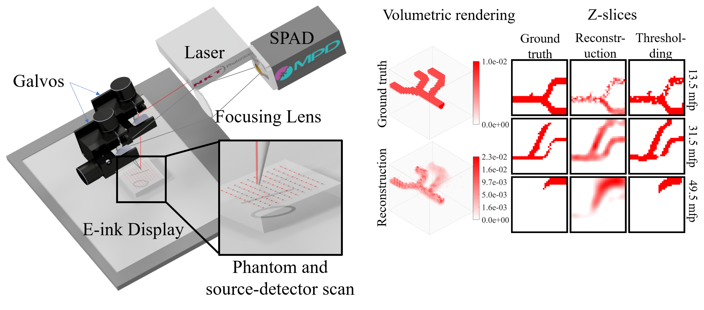

# CToF-DOT Code



Attached is the associated code for our CToF-DOT publication [1]. The code for each figure (assuming it required a simulation or image reconstruction) is placed in its own directory. Within each directory, you will find a RUNME program which should should run out-of-the-box. Note, most programs will create a `fig/` directory at the same level as this package. In this `fig/` directory, you will find the output/plots for the program. Most datasets also require data. This dataset for each program can be found at [this link](https://rice.box.com/s/lykgcol5o3ltrf9m92myqhcjv6rj4736). Please download the file, rename the directory to `dat`, and place the folder in the top level directory before running. 

Contact: Yongyi Zhao (yongyi@rice.edu)

Additional contributors include:
- Ankit Raghuram (Rice University)
- Hyun Kim (Columbia University and New York University)
- Vivek Boominathan (Rice University)

If you end up using our code or data, please also cite us, thank you!

```
@article{Zhao2021,
  author={Zhao, Yongyi and Raghuram, Ankit and Kim, Hyun K. and Hielscher, Andreas H. and Robinson, Jacob T. and Veeraraghavan, Ashok},
  journal={IEEE Transactions on Pattern Analysis and Machine Intelligence}, 
  title={High Resolution, Deep Imaging Using Confocal Time-of-Flight Diffuse Optical Tomography}, 
  year={2021},
  volume={43},
  number={7},
  pages={2206-2219},
  doi={10.1109/TPAMI.2021.3075366}}
```

Misc. Notes:
1. Our image reconstructions use the FISTA linear inverse solver [2]. 
2. To run our code, you must separately download certain plotting programs. The copyright notices for these codes are included in the file `copyright_info.txt` They are listed below along with the directory in which they should be placed:
- export_fig (place in top level directory): https://www.mathworks.com/matlabcentral/fileexchange/23629-export_fig
- voxel (place in the directory: lib/): https://www.mathworks.com/matlabcentral/fileexchange/3280-voxel
- vol3d (place in the directory: lib/): https://www.mathworks.com/matlabcentral/fileexchange/22940-vol3d-v2
3. Please note, a small modification was made to the vol3d function, and so it is included in this package

References:

[1] Y. Zhao, A. Raghuram, H. Kim, A. Hielscher, J. T. Robinson and A. N. Veeraraghavan, "High Resolution, Deep Imaging Using Confocal Time-of-flight Diffuse Optical Tomography," in IEEE Transactions on Pattern Analysis and Machine Intelligence, doi: 10.1109/TPAMI.2021.3075366.

[2] Amir Beck and Marc Teboulle. 2009. A Fast Iterative Shrinkage-Thresholding Algorithm for Linear Inverse Problems. SIAM J. Img. Sci. 2, 1 (January 2009), 183–202. DOI:https://doi.org/10.1137/080716542
